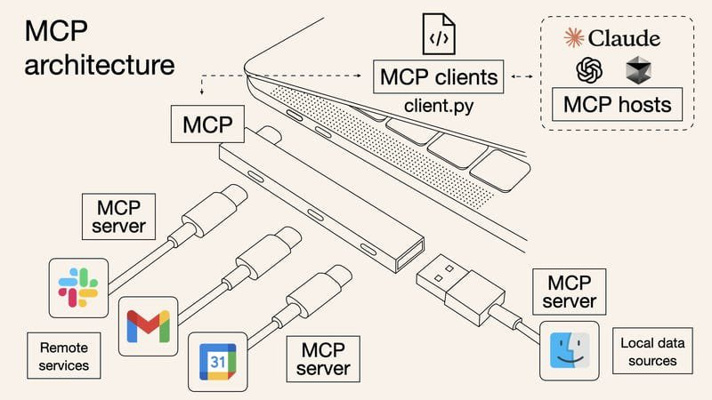
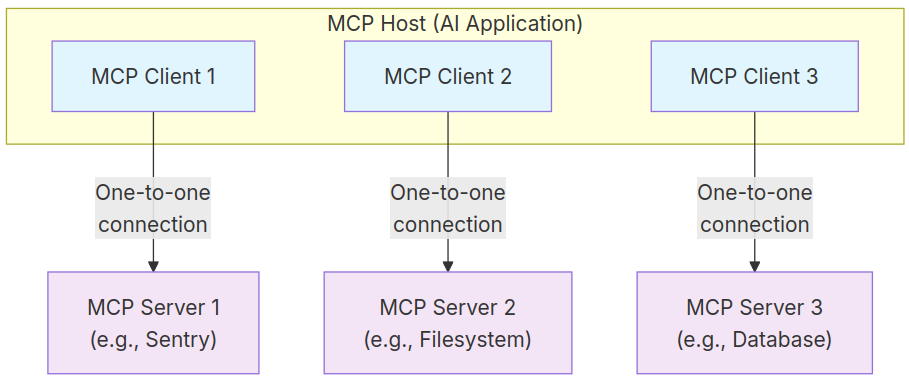

# <samp>Neovim Configuration with Lazy.nvim</samp>

Esta configuración ha migrado de **Packer.nvim** a **Lazy.nvim** como 
gestor de plugins. Voy a detallar la estructura nueva, los 
prerrequisitos, y las instrucciones paso a paso para instalar y 
ejecutar Neovim sin errores.

## 1. Contexto de la Migración

Anteriormente, esta configuración utilizaba el gestor de plugins 
[Packer.nvim](https://github.com/wbthomason/packer.nvim). La 
estructura fue hecha siguiendo el video de **Charlie L** en su canal 
de YouTube:

[Video de referencia: "Configuración Neovim con Lazy.nvim" por
Charlie L](https://www.youtube.com/watch?v=Y2iqRZ4EYbk)

### Estructura nueva (basada en Lazy)

```zsh
.
├── init.lua
├── lazy-lock.json
├── lua
│   ├── config
│   │   ├── keymaps.lua
│   │   ├── lazy.lua
│   │   └── options.lua
│   └── plugins
│       ├── avante.lua
│       ├── colorscheme.lua
│       ├── completion.lua
│       ├── copilot.lua
│       ├── core.lua
│       ├── mcphub.lua
│       ├── telescope.lua
│       └── ui.lua
└── README.md
```

La nueva versión tiene un nuevo enfoque sugerido por el
ecosistema de [Lazy.nvim](https://lazy.folke.io/installation)

## 2. Instalación y Prerrequisitos

Para evitar errores comunes como los relacionados con `tree-sitter`,
`node`, o `ripgrep`, se especifica los requisitos necesarios que
debes instalar en tu Sistema Operativo.

> [!WARNING]
> Las configuraciones que se hacen en esta sección y posteriores
> están orientadas a **distribuciones Linux**.

### Requisitos del sistema

Asegúrate de tener las siguientes herramientas instaladas:

| Requisito       | Versión mínima | Instalación en Arch Linux           |
| --------------- | -------------- | ----------------------------------- |
| Neovim          | `v0.10.0`      | `sudo pacman -S neovim`             |
| Git             | Anyone         | `sudo pacman -S git`                |
| GCC / Clang     | Anyone         | `sudo pacman -S base-devel`         |
| ripgrep         | Anyone         | `sudo pacman -S ripgrep`            |
| fd              | Anyone         | `sudo pacman -S fd`                 |
| Node.js + npm   | Recommended    | `volta install node` (ver abajo)    |
| tree-sitter CLI | Required       | `cargo install tree-sitter-cli`     |
| Rust (cargo)    | Required       | `sudo pacman -S rust`               |

#### ¿Por qué los prerrequisitos?

-   **Neovim**: Versión mínima `v0.10.0` necesaria para aprovechar las últimas
    características y compatibilidad con plugins modernos.
-   **Git**: Clonar y gestionar los repositorios de configuraciones y
    plugins.
-   **GCC/Clang**: Requerido para construir dependencias que requieran
    compilación, como parsers para `nvim-treesitter`.
-   **ripgrep**: Utilizado por `telescope.nvim` para realizar búsquedas
    rápidas en el contenido de los archivos.
-   **fd**: Utilizado por `telescope.nvim` para listar y filtrar
    archivos de manera eficiente.
-   **Node.js + npm**: Necesario para instalar y ejecutar herramientas basadas
    en JavaScript, como parsers para `nvim-treesitter` y soporte LSP.
-   **tree-sitter CLI**: Configura y compila parsers avanzados de
    sintaxis en `nvim-treesitter`.
-   **Rust (cargo)**: Utilizado para instalar herramientas como
    `tree-sitter CLI` y otros binarios necesarios para el correcto
    funcionamiento del entorno.

> [!IMPORTANT]
> Se recomienda usar [Volta](https://volta.sh) para gestionar la
> instalación de versiones de `node`, `npm`, `pnpm`, etc.

#### Instalar Volta + Node.js

```zsh
# Volta install
curl https://get.volta.sh | bash
source ~/.zshrc  # o ~/.bashrc

# Install Node.js
volta install node
volta install pnpm
```

#### Instalar tree-sitter CLI

```zsh
cargo install tree-sitter-cli
```

---

## 3. Intelligent Neovim

Los plugins **mcphub.nvim** y **avante.nvim** convierten a Neovim en
una herramienta más inteligente y eficiente como los nuevos IDEs
que han surgido con el crecimiento del uso de la Inteligencia
Artificial.

### 3.1. Model Context Protocol (MCP)

MCP es un protocolo abierto que estandariza la forma en que las
aplicaciones proporcionan contexto a los modelos de lenguaje grandes
(LLM).

Piensa en MCP como un puerto USB-C para aplicaciones de IA. Al igual
que el USB-C proporciona una forma estandarizada de conectar tus
dispositivos a diversos periféricos y accesorios, MCP proporciona una
forma estandarizada de conectar modelos de IA a diferentes fuentes de
datos y herramientas. MCP te permite crear agentes y flujos de trabajo
complejos sobre LLM y conecta tus modelos con el mundo.
[Model Context Protocol](https://modelcontextprotocol.io/docs/getting-started/intro)



### 3.2. Roles MCP y cómo encajan Avante y McpHub

*   **Host MCP**: la **aplicación de IA** que coordina uno o varios
    clientes MCP y usa el contexto que éstos aportan.
*   **Cliente MCP**: el componente que **mantiene la conexión** con un
    servidor MCP y **trae contexto** (herramientas/recursos) para
    el host.
*   **Servidor MCP**: programa que **expone herramientas/recursos**
    para los clientes MCP.



> [!IMPORTANT]
> Los **LLM** (Claude, GPT-4o, Copilot, etc.) **no forman parte del
> protocolo MCP**; MCP estandariza cómo las apps obtienen
> contexto/herramientas para el modelo, no el modelo en sí.

### 3.3. Instalación de los plugins `mcphub.nvim` y `avante.nvim`

#### Plugin [mcphub.nvim](https://github.com/ravitemer/mcphub.nvim)

Es el **cliente MCP** que se conecta a servidores MCP (Git, FS, SQL,
etc.) y pone sus herramientas/recursos a disposición del host (Avante).

> [!NOTE]
> La instalación y la configuración se encuentra en el archivo
> [`./lua/plugins/mcphub.lua`](./lua/plugins/mcphub.lua)

#### Plugin [avante.nvim](https://github.com/yetone/avante.nvim?tab=readme-ov-file)

Avante es la app de IA en Neovim que orquesta prompts,
plantillas y la sesión con el modelo; consume contexto que le
entrega un cliente MCP. (Avante añade soporte MCP a través de
mcphub.nvim).

> [!NOTE]
> La instalación y la configuración se encuentra en el archivo
> [`avante.lua`](./lua/plugins/avante.lua)
> En este caso, estamos usando copilot como proveedor,
> por ello, se necesita instalar el plugin de
> [copilot](https://github.com/zbirenbaum/copilot.lua)
> que se encuentra en el archivo
> [`copilot.lua`](./lua/plugins/copilot.lua)


> [!IMPORTANT]
> Una vez que se ha instalado correctamente el plugin, y
> **posiblemente ha surgido un error como**
>
> ```zsh
> Error executing lua callback: .../avante/llm.lua:279: Make sure to build avante (missing avante_templates)
> ```
>
> al intentar usar Avante por primera vez, necesitas compilar
> manualmente los templates de Avante. Para hacerlo, entra a la
> directorio del plugin y ejecuta:
>
> ```zsh
> cd ~/.local/share/nvim/lazy/avante.nvim
> make
> ```
>
> Después de esto, reinicia Neovim y Avante funcionará correctamente.

---

## References and resources

- [Architecture Overview](https://modelcontextprotocol.io/docs/concepts/architecture?utm_source=chatgpt.com)
- [Model Context Protocol (MCP)](https://docs.anthropic.com/en/docs/mcp?utm_source=chatgpt.com)
- [yetone/avante.nvim: Use your Neovim like using Cursor AI](https://github.com/yetone/avante.nvim?utm_source=chatgpt.com)
- [ravitemer/mcphub.nvim: An MCP client for Neovim](https://github.com/ravitemer/mcphub.nvim?utm_source=chatgpt.com)
- [Build an MCP Server](https://modelcontextprotocol.io/quickstart/server?utm_source=chatgpt.com)
- [Lazy.nvim Docs](https://lazyvim.org/)
- [Tree-sitter](https://tree-sitter.github.io/)
- [ripgrep](https://github.com/BurntSushi/ripgrep)
- [fd](https://github.com/sharkdp/fd)
- [Volta](https://volta.sh)
- [Rust (cargo)](https://www.rust-lang.org/tools/install)
